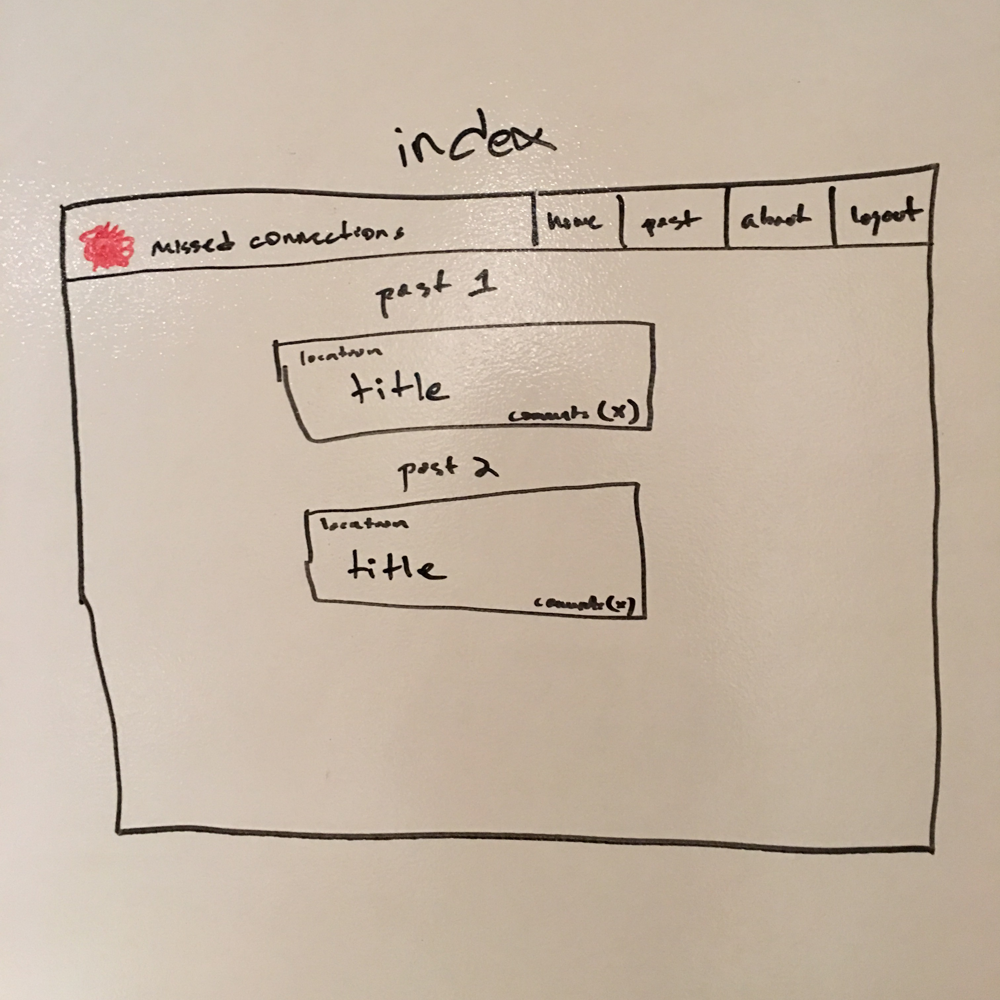
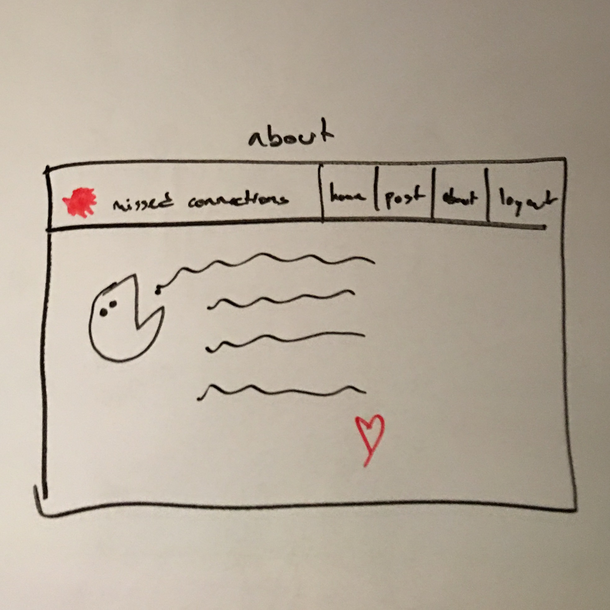

#Project 2: GA Missed Connections
###Introduction
By the end of Project 2, I will have created a "missed connections" website for citizens of General Assembly. I will use techinical skills learned over the first 5 weeks of WDI create a light-hearted way for users to post about a missed connection and for other users to comment on it. 

###Technologies Used:
* HTML
* Ruby
* Ruby on Rails
* CSS/SCSS/Bootstrap
	

###Approach
I will use the technologies listed above to render a CRUD app in the browser. 

###Installation Instructions
* Clone the repo
* Navigate to directory in terminal
* run bundle install
* run rails db:create
* run rails db:migrate
* run rails s
* navigate to localhost:3000 and use the app

###Trello Board
<a href="https://trello.com/b/3YUf6ckR/wdi-sm-43-project-2" target = "_blank">GA Missed Connections Trello</a>'

###Unresolved Issues
* No way to edit comments yet
* Cannot filter posts by location
* No admin user to remove bad content

###Entity Relationship Diagram (ERD):

###Wireframes:
Log In:

Sign Up:

Feed:

Profile:

Post:

Create/Edit Post:

About:
